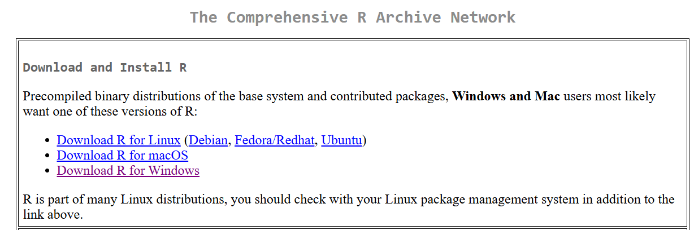
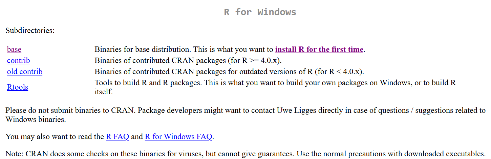
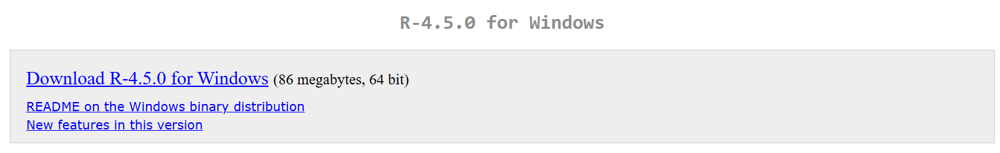

The first step this week is to install R and RStudio.

If you already have R and RStudio installed, there is nothing you need to do! If you would like, you can investigate some of the resources outlined on the main page or help a colleague get their R and R Studio installed. 

## Steps

### **Install R**  

1. Click here to start: [CRAN](https://cran.r-project.org/).

2. Select either "Download R for Windows" or "Download R for macOS" depending on your operating system. 

Moving forward, the screenshots will be for the Windows installation. However, the steps will be the same for the Mac installation.

3. Select the "base" distribution link.

4. Click on the download link.

5. You should see R-4.5.0.exe in your downloads. Click on it, and follow the prompts. Keep all of the default settings - no need to change anything. 

6. R should be installed! 

## **Install RStudio**

This is what R looks like to use. It is relatively simple.  

On the other hand, RStudio offers more tools. The language is still R, but it is a more polished and user-friendly environment. This is what RStudio looks like. We'll explore more next week what each of the panes are and more about the functionality!

1. Click on this [link:](https://posit.co/download/rstudio-desktop/). 

2. You've already installed R, so select "Install RStudio".

3. You should see an RStudio .exe file in your downloads. Click on it, and follow the prompts. Keep all of the default settings - no need to change anything. 

4. RStudio should be installed! To verify, try opening it - search for RStudio in your programs, and open it. I suggest you save to either your Desktop or Start Menu so it's easy to find, if it isn't already installed there.

# Resources 

Here is a helpful video to walk you through this process:

https://www.youtube.com/watch?v=H9EBlFDGG4k

# Stuck?

Initially, contact your site leads

- **Mozambique**: Miguel  
- **Eswatini**: Ntsiki, Geez, Mbongeni  
- **Uganda**: Abigail
- **Other**: Abigail

If you are still stuck, contact Abigail.