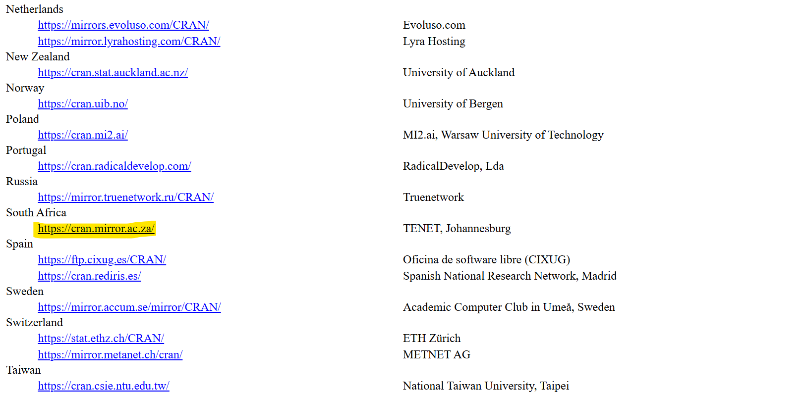

# Week 1

This week, you will be installing R and RStudio.

If you already have R and RStudio installed, there is nothing you need to do! If you would like, you can investigate some of the resources outlined on the main page. 

## Steps

1. **Install R**:  
   Download and install R from [CRAN](https://cran.r-project.org/).

You will be asked to select a "CRAN Mirror". This is the location of the server from which you're going to download R and later, R packages (you'll learn about those in the coming weeks)! As an analogy, this is like going to the closest library to you to check out a book. Please choose a location close to you for faster download - for those based in Africa, this will be the South Africa link:

2. **Install RStudio**:  
   Download and install RStudio from [RStudio's website](https://posit.co/download/rstudio-desktop/). 

Here is a helpful video to walk you through this process:

https://www.youtube.com/watch?v=H9EBlFDGG4k

# Stuck?

Initially, contact your site leads

- **Mozambique**: Miguel  
- **Eswatini**: Ntsiki, Geez, Mbongeni  
- **Uganda**: Abigail
- **Other**: Abigail

If you are still stuck, contact Abigail.