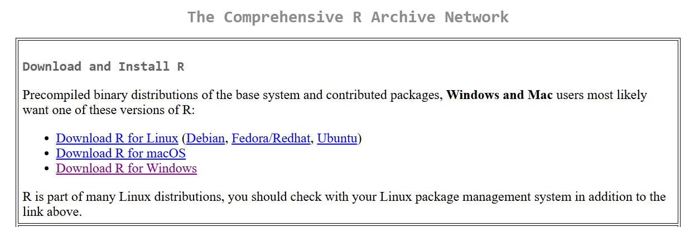
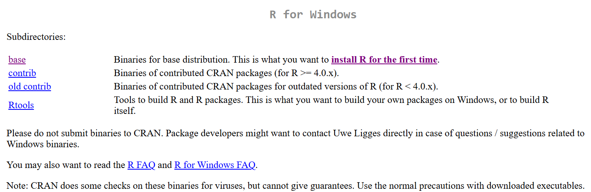
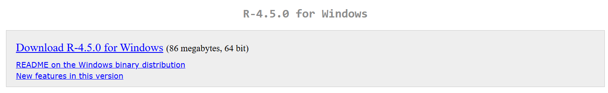

# Week 1

This week, you will be installing R and RStudio.

If you already have R and RStudio installed, there is nothing you need to do! If you would like, you can investigate some of the resources outlined on the main page. 

## Steps

### **Install R**  

1. Click here to start: [CRAN](https://cran.r-project.org/).

2. Select either "Download R for Windows" or "Download R for macOS" depending on your operating system. 

Moving forward, the screenshots will be for the Windows installation. However, the steps will be the same for the Mac installation.

3. Select the "base" distribution link.

4. Click on the download link.

5. You should see R-4.5.0.exe in your downloads. Click on it, and follow the prompts. Keep all of the default settings - no need to change anything. 

6. R should be installed! 

2. **Install RStudio**:  
   Download and install RStudio from [RStudio's website](https://posit.co/download/rstudio-desktop/). 

Here is a helpful video to walk you through this process:

https://www.youtube.com/watch?v=H9EBlFDGG4k

# Stuck?

Initially, contact your site leads

- **Mozambique**: Miguel  
- **Eswatini**: Ntsiki, Geez, Mbongeni  
- **Uganda**: Abigail
- **Other**: Abigail

If you are still stuck, contact Abigail.