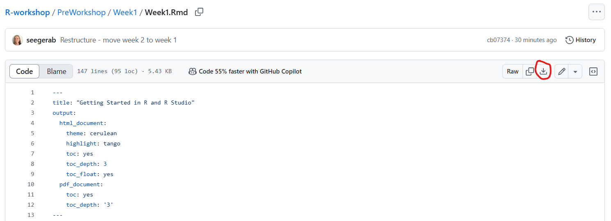

# Week 1

This week, you will be installing R and R Studio and get an introduction to both. For all links, it may be easiest to right-click and open in new tab.

1. Watch <a href="https://www.youtube.com/watch?v=5wy6JDx_a7g" target="_blank">this video</a>  
2. Install R and R Studio using the steps provided <a href="https://github.com/seegerab/R-workshop/blob/main/PreWorkshop/Week1/Installing%20R%20and%20R%20Studio.md" target="_blank">here</a>  
3. Complete <a href="https://github.com/seegerab/R-workshop/blob/main/PreWorkshop/Week1/Week1.Rmd" target="_blank">Week1.Rmd</a>  

- Once you click on the link, you will need to download the .Rmd file by clicking on the download button, circled below

- The .Rmd will be in your downloads folder. Please move this to a folder that you create for this workshop.

- Once the file is in its final destination, clicking on the .Rmd should pull up the file in R Studio.

4. Fill out <a href="https://docs.google.com/forms/d/e/1FAIpQLScHDv_sdD-A_I8uOVBGRtkj-618DtXySOEBCeE0qBMk0zfpYA/viewform?usp=dialog" target="_blank">this survey</a>  
5. Celebrate! You completed everything for week 1.